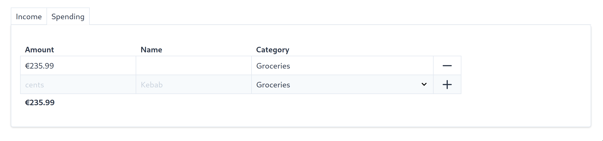
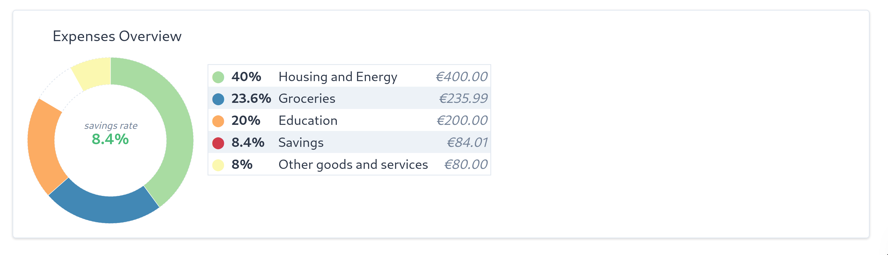

This is a simple Next.js app to create an overview PDF of your budget.

1. Enter income and expenditures
2. Store them locally if you need to work on them later
3. Generate a nice PDF

## Usage

Enter some income and expenditures. I generate one report for each salary period.



View some basic analytics. Output is optimized to be printed.



## Roadmap

This is in development. Next features:

* :heavy_check_mark: re-set `localStorage`, e.g. to get started with next month
* :heavy_check_mark: leverage print media queries for PDF stuff
* :heavy_check_mark: use ~~`visx`~~ `d3` to make some nice visualizations
* :heavy_check_mark: translate categories to english
* compare spendings to recommended split from [Statista](https://de.statista.com/statistik/daten/studie/164774/umfrage/konsumausgaben-private-haushalte/)

## Getting Started

First, run the development server:

```bash
npm run dev
# or
yarn dev
```

Open [http://localhost:3000](http://localhost:3000) with your browser to see the result.

You can start editing the page by modifying `pages/index.js`. The page auto-updates as you edit the file.

## Learn More

To learn more about Next.js, take a look at the following resources:

- [Next.js Documentation](https://nextjs.org/docs) - learn about Next.js features and API.
- [Learn Next.js](https://nextjs.org/learn) - an interactive Next.js tutorial.

You can check out [the Next.js GitHub repository](https://github.com/vercel/next.js/) - your feedback and contributions are welcome!

## Deploy on Vercel

The easiest way to deploy your Next.js app is to use the [Vercel Platform](https://vercel.com/import?utm_medium=default-template&filter=next.js&utm_source=create-next-app&utm_campaign=create-next-app-readme) from the creators of Next.js.

Check out our [Next.js deployment documentation](https://nextjs.org/docs/deployment) for more details.
